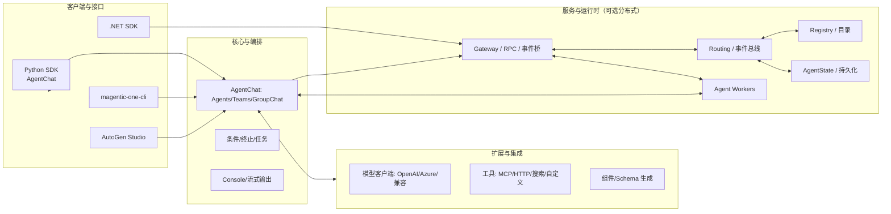
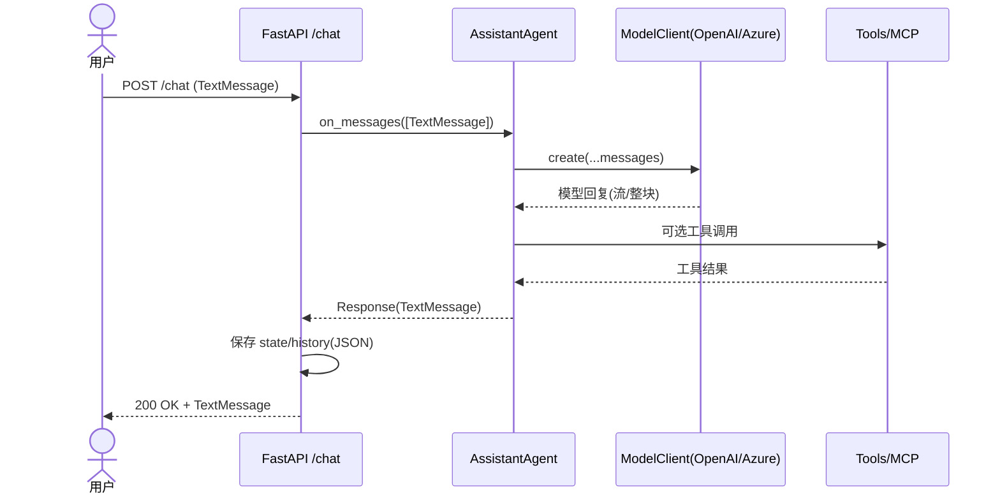

# AutoGen 源码流程与架构详解

本篇面向希望系统化理解 AutoGen 源码结构与一次请求端到端执行流程的读者。结合仓库实际代码，覆盖核心包、关键抽象、调用链与常见问题。

## 代码包总览（Python）
- `python/packages/autogen-agentchat`：多智能体编排与对话核心（Agents、Teams、GroupChat、消息模型、终止条件、UI Console 等）。
- `python/packages/autogen-core`：底层模型与运行时抽象（消息类型、模型接口、内存、运行时概念）。
- `python/packages/autogen-ext`：扩展与集成（OpenAI/Azure 等模型客户端、HTTP/MCP 等工具）。
- 其他：
  - `autogen-studio`（GUI）、`agbench`（基准/评测）、`magentic-one-cli`（CLI）、`protos/*`（跨进程协议定义）。

## 高层架构

## 核心概念与关键文件
- 消息模型（Message）
  - 文件：`autogen-agentchat/messages.py`
  - 抽象：`BaseMessage`、`BaseChatMessage`、`BaseAgentEvent`、`TextMessage` 等。
  - 要点：`BaseMessage.dump()` 使用 Pydantic `mode="json"`，会把 `datetime` 转为 ISO 字符串，便于持久化。
- 助手 Agent（AssistantAgent）
  - 文件：`autogen-agentchat/agents/_assistant_agent.py`
  - 要点：
    - 对外提供 `on_messages`/`on_messages_stream`，组织模型调用、工具调用、上下文管理与终止条件判断。
    - `save_state`/`load_state` 通过 `state/_states.py` 的模型持久化 LLM 上下文。
- 基类与编排
  - 文件：`autogen-agentchat/base/_chat_agent.py`（抽象 Agent 行为）、`teams/_group_chat/*`（顺序/轮询/选择/有向图编排）。
- 模型客户端（Model Client）
  - 文件：`autogen-ext/models/openai/_openai_client.py`、`.../config/__init__.py`
  - 要点：统一的 `ChatCompletionClient` 组件化加载 `load_component(config)`，支持 OpenAI/Azure/兼容端点。
- 工具与 MCP
  - 目录：`autogen-ext/tools/*`、`.../tools/mcp/*`
  - 要点：将外部 API/系统包装为可由 Agent 调用的工具，支持 MCP 工作台。
- 运行时与主题（Core）
  - 文档：`docs/design/01 - Programming Model.md`、`02 - Topics.md`、`03 - Agent Worker Protocol.md`、`05 - Services.md`
  - 示例：`python/samples/core_streaming_handoffs_fastapi/app.py` 展示 `SingleThreadedAgentRuntime`、`TypeSubscription`、`TopicId` 的事件驱动模型。

## 端到端请求流程（以 FastAPI 示例为例）
入口：`python/samples/agentchat_fastapi/app_agent.py`
1) HTTP 请求到 `/chat`，构造 `TextMessage`。
2) `get_agent()` 加载模型配置（`model_config.yaml` 或环境变量）并实例化 `AssistantAgent`。
3) 调用 `agent.on_messages([...])`：
   - 组装 LLM 上下文 → 调用模型（可流式）→ 触发工具（如 MCP/HTTP）→ 产生回复。
4) `save_state()` 持久化 Agent 状态到 `agent_state.json`。
5) 将请求与回复写入 `agent_history.json`（使用 `BaseMessage.dump()` 确保 JSON 安全）。
6) 返回 `TextMessage` 响应给客户端。

时序图：

## 编排（Teams/GroupChat）一览
- 轮询（RoundRobin）：`teams/_group_chat/_round_robin_group_chat.py`
- 选择器（Selector）：`teams/_group_chat/_selector_group_chat.py`
- 有向图（DiGraph）：`teams/_group_chat/_graph/_digraph_group_chat.py`
- Swarm/Sequential/自定义：见同目录其他实现。

核心思路：编排器决定“谁说话”，并在多 Agent 间路由消息，直到终止条件满足（`conditions/_terminations.py`）。

## Core 事件/主题/运行时
- 关键概念：TopicId(type, source)、AgentId(type, key)、订阅与映射（见 `docs/design/02 - Topics.md`）。
- 运行时：`SingleThreadedAgentRuntime`（内存通道演示），Agent 通过订阅接受消息。
- Worker/Service 协议：见 `docs/design/03 - Agent Worker Protocol.md` 与 `05 - Services.md`。

## 配置与加载优先级
- 示例中的加载顺序（已在 `app_agent.py` 增强）：
  1) `MODEL_CONFIG_PATH` 指向的 YAML（默认 `model_config.yaml`）
  2) `MODEL_CONFIG` 环境变量（YAML 字符串）
  3) 环境变量：
     - OpenAI：`OPENAI_API_KEY`（可配 `OPENAI_MODEL`）
     - Azure：`AZURE_OPENAI_ENDPOINT`、`AZURE_OPENAI_API_VERSION`、`AZURE_OPENAI_API_KEY`、`AZURE_OPENAI_DEPLOYMENT`

## 常见问题与排查
- JSON 序列化失败（datetime）：使用 `BaseMessage.dump()` 或 `json.dumps(..., default=...)`。
- 模型认证失败：检查 OpenAI/Azure 环境变量与 YAML 配置项拼写。
- 工具不可用：确认工具函数签名与注册位置，必要时开启日志查看调用参数。

## 阅读与扩展建议
- 从 `AssistantAgent.on_messages` 入手，顺藤摸瓜到模型与工具调用。
- 对照 `core_streaming_handoffs_fastapi` 理解事件驱动与主题路由，再回看 `docs/design/*`。
- 如需自定义编排器，在 `teams/_group_chat/_base_group_chat.py` 基类上继承实现。

---
本文可配合仓库内以下图示与文档：
- 流程图：`docs/diagrams/autogen-项目流程图.md`
- 架构图：`docs/diagrams/autogen-项目架构图.md`
- 设计文档：`docs/design/*.md`
