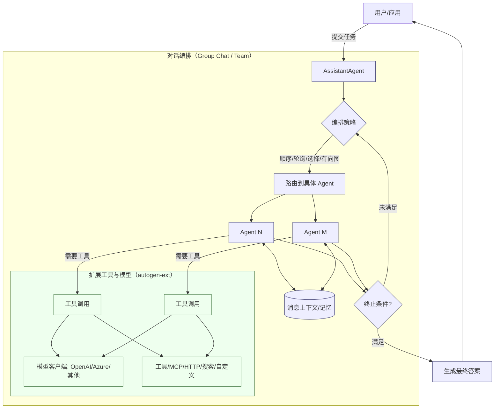

# AutoGen 项目流程图（AgentChat 交互）

```mermaid
flowchart TB
    U[用户/应用] -->|提交任务| A[AssistantAgent]
    subgraph GC[对话编排（Group Chat / Team）]
        direction TB
        A --> MGR{编排策略}
        MGR -->|顺序/轮询/选择/有向图| R1[路由到具体 Agent]
        R1 --> AG1[Agent N]
        R1 --> AG2[Agent M]
        AG1 <--> MSG[(消息上下文/记忆)]
        AG2 <--> MSG
        AG1 -->|需要工具| T1[工具调用]
        AG2 -->|需要工具| T2[工具调用]
        subgraph EXT[扩展工具与模型（autogen-ext）]
            direction TB
            T1 --> MC[模型客户端: OpenAI/Azure/其他]
            T2 --> MC
            T1 --> Tools[工具/MCP/HTTP/搜索/自定义]
            T2 --> Tools
        end
        AG1 --> EVT{终止条件?}
        AG2 --> EVT
        EVT -->|未满足| MGR
    end
    EVT -->|满足| OUT[生成最终答案]
    OUT --> U

    classDef core fill:#eef,stroke:#447,stroke-width:1px;
    classDef ext fill:#efe,stroke:#474,stroke-width:1px;
    class A,MGR,R1,AG1,AG2,MSG,EVT,OUT core;
    class EXT,MC,Tools,T1,T2 ext;
```

说明：
- 用户将任务提交给 `AssistantAgent`。
- 由编排器（顺序/轮询/选择器/图）在团队内路由到合适的 Agent。
- Agent 可调用 `autogen-ext` 中的模型客户端与工具（含 MCP）。
- 通过终止条件判断（如达成目标、最大轮数等）结束，汇总并返回最终结果。

